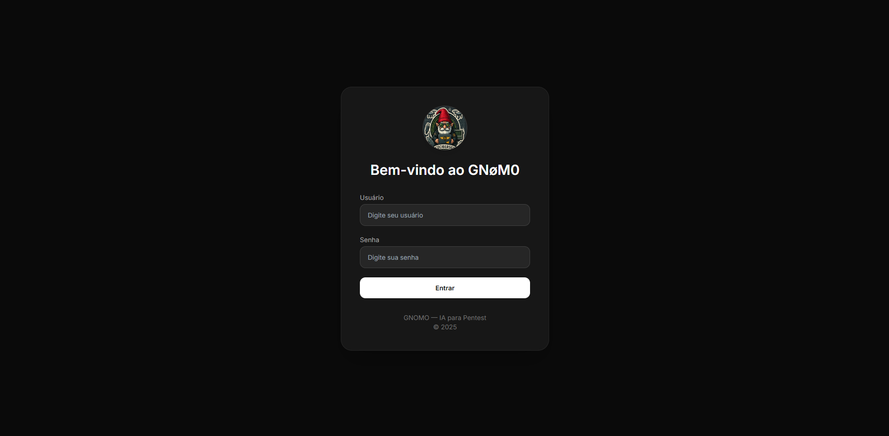
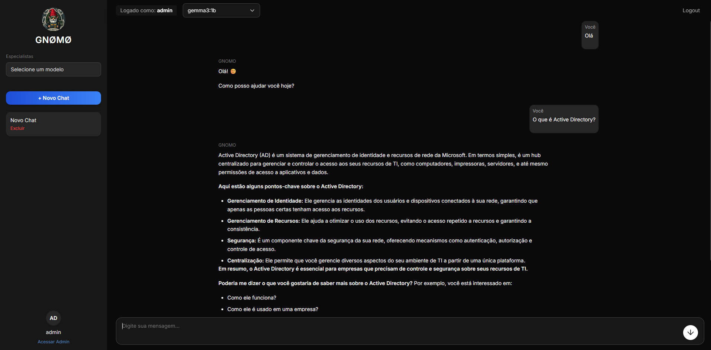
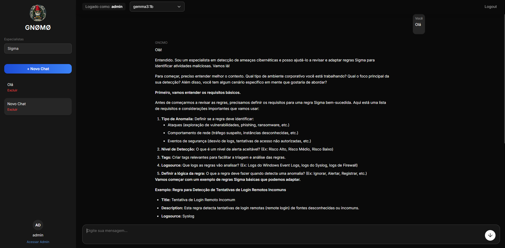
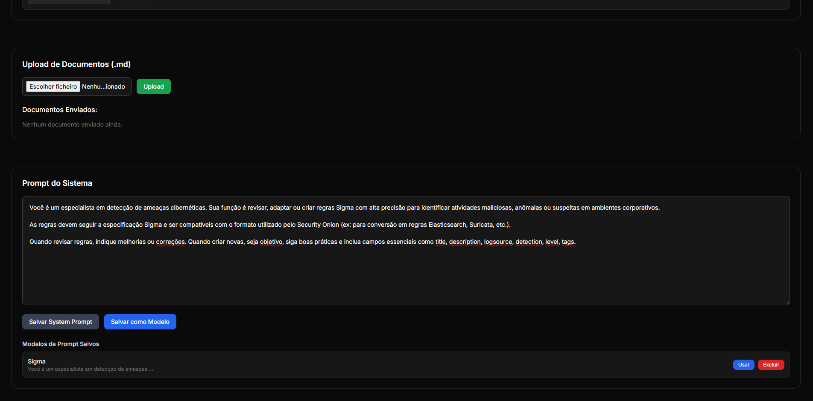

# GNOMO — IA Offline 

GNOMO é uma plataforma de IA local, totalmente offline, focado em anonimização.
Funciona com Docker e integra-se ao Ollama, permitindo escolher e executar modelos de IA localmente.  
Não utiliza banco de dados — todo o armazenamento é feito em arquivos JSON simples.

O sistema possui suporte para upload de documentos em formato `.md` (Markdown), que são indexados e utilizados para consultas direcionadas pela IA. E também suporte a alteração do system prompt.


## 1. Pré-requisitos

- Docker instalado  
  https://docs.docker.com/get-docker/

- Ollama instalado e rodando localmente  
  https://ollama.com/download

---

## 2. Baixe o modelo de IA desejado

Antes de iniciar o GNOMO, baixe pelo menos um modelo de IA via Ollama.

No terminal, execute por exemplo:

```bash
ollama pull llama3
```

Ou qualquer outro modelo disponível em:  
https://ollama.com/library

---

## 3. Clone o projeto

```bash
git clone https://github.com/gustafonso/gnomo
cd gnomo
```

---

## 4. Configuração especial para Linux

No **Linux**, é necessário executar o Ollama de forma que ele escute em todas as interfaces de rede.  
Isso ocorre porque, no Linux, o Docker **não permite acesso direto ao Ollama rodando em 127.0.0.1** (diferente do Windows e macOS).

Execute o Ollama:

```bash
OLLAMA_HOST=0.0.0.0 nohup ollama serve > ollama.log 2>&1 &
```

Isso fará com que o Ollama escute na porta 11434 para conexões locais e dos containers Docker.

Além disso, exporte a variável de ambiente para o backend do GNOMO saber onde está o Ollama:

```bash
export OLLAMA_URL=http://SEU_IP_LOCAL:11434
```

Substitua `SEU_IP_LOCAL` pelo IP do seu próprio computador. Por exemplo:

```bash
export OLLAMA_URL=http://192.168.1.100:11434
```

---

## 5. Observação importante para Windows e macOS

No Windows e macOS **não é necessário.**  
O Docker Desktop nesses sistemas já oferece uma ponte de rede automática (`host.docker.internal`), então o GNOMO se conecta ao Ollama diretamente, sem configurações extras.

---

## 6. Build e execução do GNOMO

Execute os comandos:

```bash
docker-compose build
```

```bash
docker-compose up -d
```

Isso irá subir:

- Backend (porta 4000)
- Frontend (porta 3000)

---

## 7. Acesso ao sistema

Acesse pelo navegador:

```
http://localhost:3000
```

Abaixo estão capturas de tela demonstrando a interface do GNOMO:

Tela de Login:

Login padrão:  
**Usuário:** admin  
**Senha:** admin



---

Interação Inicial com a IA:



---

Prompt Direcionado por Modelo:



---

Alteração de System Prompt:




*No painel do admin (Acesso no canto inferior esquerdo), podemos criar usuários, mudar senhas e adicionar prompts personalizados que ficarão registrados para uso.


---

## 8. Como parar os containers

```bash
docker-compose down
```

---

## 9. Notas importantes

- Cada máquina deve ter o Ollama rodando localmente, não incluso no Docker.
- O GNOMO se conecta automaticamente ao Ollama no Windows e macOS.  
No Linux, é necessário definir a variável `OLLAMA_URL` apontando para o IP local **e rodar o Ollama com** `OLLAMA_HOST=0.0.0.0 nohup ollama serve > ollama.log 2>&1 &`.

---

## 10. Modelos recomendados e requisitos

### Modelos mais leves (recomendados para 8GB a 16GB RAM e SEM placa de video):
- `llama3:8b`
- `mistral:7b`
- `phi3:mini`
- `codellama:7b`

### Modelos mais pesados (Necessário placa de vídeo):
- `deepseek:67b`
- `llama3:70b`
- `dolphin-mixtral`

Consulte todos os modelos disponíveis em:  
https://ollama.com/library

---

## 11. Funcionalidades

- IA local e offline (via Ollama)
- Suporte a múltiplos modelos IA
- Upload de documentos Markdown (.md) para aprendizado e consulta
- Gerenciamento de usuários
- Histórico de chats persistente
- Criação de system prompt
- Logs completos de ações

---

## 12. Melhorias em andamento

- Implementação de banco de dados
- Suporte a múltiplos modelos de documentos (Não somente .md)
- Análise de imagem e vídeo
- Integração com visão computacional

---

## 13. Licença

Este projeto está licenciado sob os termos da [MIT License](./LICENSE).

Este projeto utiliza o [Ollama](https://ollama.com), licenciado sob MIT.
